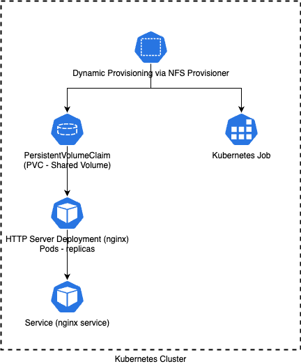

# Large-Scale-Computing
Created for Large Scale Computing course at AGH UST
## Lab 6 - Kubernetes
Architecture <br>

### Set up Kubernetes app
#### Prerequisites
Make sure You have Minikube and Helm installed, else: <br>
Install minikube
```
# (macOS/Linux)
brew install minikube  # macOS
# OR (Linux)
curl -LO https://storage.googleapis.com/minikube/releases/latest/minikube-linux-amd64
sudo install minikube-linux-amd64 /usr/local/bin/minikube

# Start the cluster
minikube start --driver=docker  # Use Docker, VirtualBox, or HyperKit
```
Install Helm
```
curl -fsSL -o get_helm.sh https://raw.githubusercontent.com/helm/helm/main/scripts/get-helm-3
chmod 700 get_helm.sh
./get_helm.sh
```
#### Install NFS Server/Provisioner with Helm
```
# Add the Helm repository
helm repo add nfs-subdir-external-provisioner https://kubernetes-sigs.github.io/nfs-subdir-external-provisioner/
helm repo update

# Install the NFS provisioner
helm install nfs-provisioner nfs-subdir-external-provisioner/nfs-subdir-external-provisioner \
  --set storageClass.name=nfs
```
#### Create PersistentVolumeClaim
create pvc.yaml
```
apiVersion: v1
kind: PersistentVolumeClaim
metadata:
  name: nfs-pvc
spec:
  storageClassName: nfs  # Must match the Helm chart's storageClass.name
  accessModes:
    - ReadWriteMany
  resources:
    requests:
      storage: 1Gi
```
apply
```
kubectl apply -f pvc.yaml
```
#### Deploy an HHTP Server with PVC Mount
Create nginx-deployment.yaml
```
apiVersion: apps/v1
kind: Deployment
metadata:
  name: nginx-deployment
spec:
  replicas: 1
  selector:
    matchLabels:
      app: nginx
  template:
    metadata:
      labels:
        app: nginx
    spec:
      containers:
      - name: nginx
        image: nginx
        volumeMounts:
        - name: nfs-volume
          mountPath: /usr/share/nginx/html
      volumes:
      - name: nfs-volume
        persistentVolumeClaim:
          claimName: nfs-pvc
```
apply it
```
kubectl apply -f nginx-deploynent.yaml
```
#### Create a Service to expose the HTTP Server
Create nginx-service.yaml
```
apiVersion: v1
kind: Service
metadata:
  name: nginx-service
spec:
  type: NodePort  # For local access
  selector:
    app: nginx
  ports:
    - protocol: TCP
      port: 80
      targetPort: 80
```
apply it
```
kubectl apply -f nginx-service.yaml
```
#### Create a Job to copy sample content to the PVC
Create copy-job.yaml
```
apiVersion: batch/v1
kind: Job
metadata:
  name: copy-job
spec:
  template:
    spec:
      containers:
      - name: busybox
        image: busybox
        command: ["/bin/sh", "-c", "echo 'Hello from NFS!' > /data/index.html"]
        volumeMounts:
        - name: nfs-volume
          mountPath: /data
      volumes:
      - name: nfs-volume
        persistentVolumeClaim:
          claimName: nfs-pvc
      restartPolicy: Never
  backoffLimit: 1
```
apply it
```
kubectl apply -f copy-job.yaml
```
#### Test the HTTP server
Get the service URL
```
minikube service nginx-service --url
```
Check the content
```
curl http://<URL_FROM_ABOVE>
# Should return "Hello from NFS!"
```
